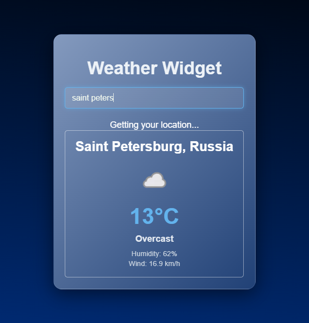

# 🌤️ Weather Widget

A clean and simple weather application built with React.  
It allows users to check current weather by city name or automatically using geolocation.

---

## ✨ Live Demo

👉 https://vercel.com/katerina2391s-projects/weather-wiget/EfvMuSjAVPkaMdkvHVzQsDfnqiy2

---

## 📸 Preview



---

## 🚀 Features

- 📍 Detects user location via browser geolocation
- 🔎 Search weather by city name
- 🌡️ Displays temperature in Celsius
- 🌥️ Shows weather condition (icon + text)
- 💧 Humidity and wind speed info
- ⏳ Loading state while fetching data
- ⚠️ Error handling for API and location issues

---

## 🛠️ Tech Stack

- React (Hooks: useState, useEffect)
- JavaScript (ES6+)
- CSS3
- WeatherAPI
- Geolocation API

---

## 📦 Installation

Clone the repository:

```bash
git clone https://github.com/Katerina2391/exchangeCalculator.git

Install dependencies:

npm install


Run the project locally:

npm run dev

🔑 API
This project uses WeatherAPI
.

To run locally, you need your own API key:

const KEY = "your_api_key_here";

🧠 What I learned
Working with REST APIs
Async data handling in React
useEffect lifecycle behavior
Geolocation API usage
Managing loading and error states

📌 Notes
This project was built for learning purposes and frontend practice.